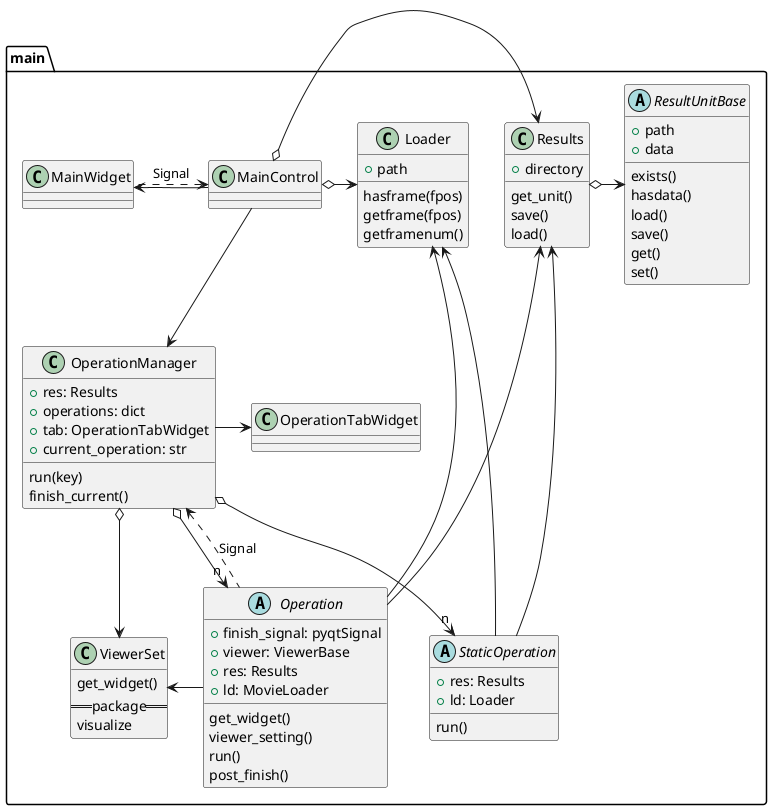
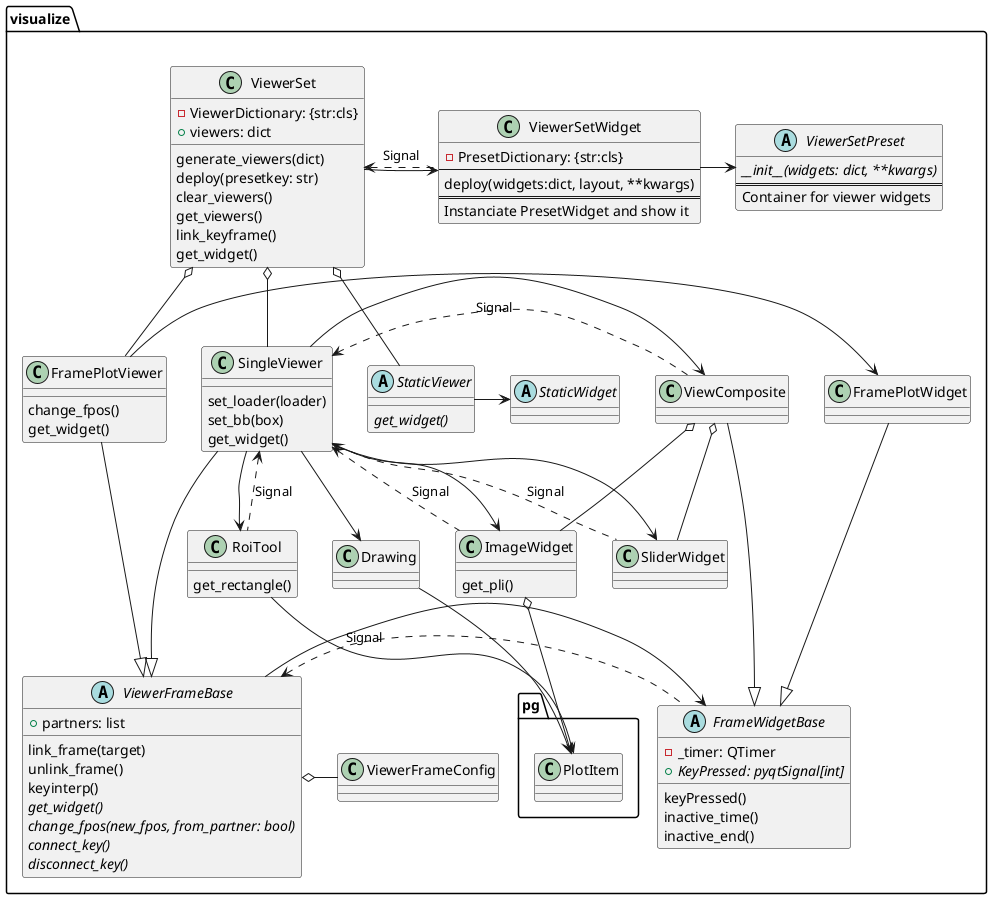

# class design

```plantuml
@startuml

package main{
    class MainControl {}
    class MainWidget {}
    abstract Operation {
        +finish_signal: pyqtSignal
        +viewer: ViewerBase
        +res: Results
        +ld: MovieLoader
        get_widget()
        viewer_setting()
        run()
        post_finish()
    }
    abstract StaticOperation{
        +res: Results
        +ld: Loader
        run()
    }
    class Results{
        +directory
        get_unit()
        save()
        load()
    }
    abstract ResultUnitBase{
        +path
        +data
        exists()
        hasdata()
        load()
        save()
        get()
        set()
    }
    class OperationManager{
        +res: Results
        +operations: dict
        +tab: OperationTabWidget
        +current_operation: str
        run(key)
        finish_current()
    }
    class OperationTabWidget{}
    class Loader{
        +path
        hasframe(fpos)
        getframe(fpos)
        getframenum()
    }
    MainControl -down-> OperationManager
    MainControl -left> MainWidget
    MainControl <. MainWidget : Signal
    MainControl o-right> Results
    MainControl o-right> Loader

    OperationManager o-down->"n" Operation
    OperationManager <.down. Operation : Signal
    OperationManager o-down->"n" StaticOperation
    OperationManager -> OperationTabWidget

    OperationManager o-> ViewerSet
    Operation -> ViewerSet

    Operation -up--> Results
    StaticOperation -up--> Results


    Operation -up--> Loader
    StaticOperation -up--> Loader

    Results o-> ResultUnitBase

    class ViewerSet{
        get_widget()
        ==package==
        visualize
    }
}
@enduml
```

```plantuml
@startuml

package visualize{
    class ViewerSet{
        -ViewerDictionary: {str:cls}
        +viewers: dict
        generate_viewers(dict)
        deploy(presetkey: str)
        clear_viewers()
        get_viewers()
        link_keyframe()
        get_widget()
    }
    class ViewerSetWidget {
        -PresetDictionary: {str:cls}
        --
        deploy(widgets:dict, layout, **kwargs)
        ==
        Instanciate PresetWidget and show it
    }
    abstract ViewerSetPreset{
        {abstract}__init__(widgets: dict, **kwargs)
        ==
        Container for viewer widgets
    }
    ViewerSetWidget -> ViewerSetPreset
    class FramePlotViewer{
        change_fpos()
        get_widget()
    }
    class FramePlotWidget{}
    FramePlotViewer -> FramePlotWidget
    class SingleViewer {
        set_loader(loader)
        set_bb(box)
        get_widget()
    }
    abstract StaticViewer{
        {abstract}get_widget()
    }
    abstract StaticWidget{
    }
    StaticViewer -> StaticWidget
    ViewerSet o-- SingleViewer
    ViewerSet o-- FramePlotViewer
    ViewerSet o-- StaticViewer
    ViewerSet -> ViewerSetWidget
    ViewerSet <. ViewerSetWidget :Signal
    class ImageWidget {
        get_pli()
    }
    class pg.PlotItem {}
    class Drawing {}
    class RoiTool{
        get_rectangle()
    }
    class SliderWidget{}
    SingleViewer --> ImageWidget
    SingleViewer <.. ImageWidget : Signal

    ImageWidget o--> pg.PlotItem
    Drawing --> pg.PlotItem
    SingleViewer --> Drawing

    SingleViewer --> RoiTool
    RoiTool --> pg.PlotItem
    SingleViewer <.. RoiTool : Signal

    SingleViewer --> SliderWidget
    SingleViewer <.. SliderWidget :Signal

    class ViewComposite{}
    SingleViewer -> ViewComposite
    SingleViewer <.. ViewComposite :Signal
    ViewComposite o- ImageWidget
    ViewComposite o- SliderWidget

    abstract FrameWidgetBase{
        -_timer: QTimer
        {abstract} +KeyPressed: pyqtSignal[int]
        keyPressed()
        inactive_time()
        inactive_end()
    }
    abstract ViewerFrameBase{
        +partners: list
        link_frame(target)
        unlink_frame()
        keyinterp()
        {abstract}get_widget()
        {abstract}change_fpos(new_fpos, from_partner: bool)
        {abstract}connect_key()
        {abstract}disconnect_key()
    }
    ViewerFrameBase -> FrameWidgetBase
    ViewerFrameBase <. FrameWidgetBase :Signal
    ViewComposite ---|> FrameWidgetBase
    SingleViewer ---|> ViewerFrameBase
    FramePlotViewer ---|> ViewerFrameBase
    FramePlotWidget ---|> FrameWidgetBase
    ViewerFrameBase o- ViewerFrameConfig

}

@enduml
```
