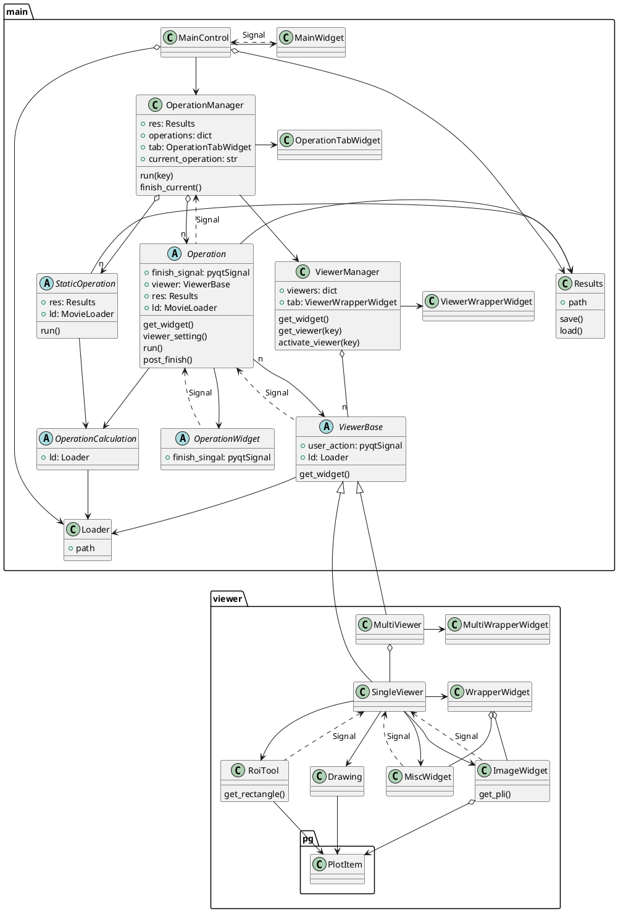

# class design

```plantuml
@startuml

package main{
    class MainControl {}
    class MainWidget {}
    abstract Operation {
        +finish_signal: pyqtSignal
        +viewer: ViewerBase
        +res: Results
        +ld: MovieLoader
        get_widget()
        viewer_setting()
        run()
        post_finish()
    }
    abstract StaticOperation{
        +res: Results
        +ld: MovieLoader
        run()
    }
    class Results{
        +path
        save()
        load()
    }
    class OperationManager{
        +res: Results
        +operations: dict
        +tab: OperationTabWidget
        +current_operation: str
        run(key)
        finish_current()
    }
    class OperationTabWidget{}
    class Loader{
        +path
    }
    class ViewerManager{
        +viewers: dict
        + tab: ViewerWrapperWidget
        get_widget()
        get_viewer(key)
        activate_viewer(key)
    }
    class ViewerWrapperWidget{}
    abstract ViewerBase {
        +user_action: pyqtSignal
        +ld: Loader
        get_widget()
    }

    MainControl --> OperationManager
    MainControl --> MainWidget
    MainControl <. MainWidget : Signal
    MainControl o-> Results
    MainControl o-> Loader

    OperationManager o-->"n" Operation
    OperationManager <.. Operation : Signal
    OperationManager o-->"n" StaticOperation
    OperationManager --> ViewerManager
    OperationManager -> OperationTabWidget

    ViewerManager o--"n" ViewerBase
    ViewerManager -> ViewerWrapperWidget
    Operation "n"--> ViewerBase
    Operation <.. ViewerBase : Signal

    Operation -> Results
    StaticOperation -> Results

    ViewerBase --> Loader

    abstract OperationWidget{
        + finish_singal: pyqtSignal
    }
    abstract OperationCalculation {
        +ld: Loader
    }

    OperationCalculation --> Loader
    Operation --> OperationWidget
    Operation <.. OperationWidget : Signal
    Operation --> OperationCalculation
    StaticOperation --> OperationCalculation
}

package viewer{
    class SingleViewer{}
    SingleViewer -up--|> ViewerBase

    class ImageWidget {
        get_pli()
    }
    class pg.PlotItem {}
    class Drawing {}
    class RoiTool{
        get_rectangle()
    }
    SingleViewer --> ImageWidget
    SingleViewer <.. ImageWidget : Signal

    ImageWidget o--> pg.PlotItem
    Drawing --> pg.PlotItem
    SingleViewer --> Drawing

    SingleViewer --> RoiTool
    RoiTool --> pg.PlotItem
    SingleViewer <.. RoiTool : Signal

    class MiscWidget{}
    class WrapperWidget{}

    SingleViewer --> MiscWidget
    SingleViewer <.. MiscWidget : Signal
    SingleViewer -left-> WrapperWidget
    WrapperWidget o- MiscWidget
    WrapperWidget o- ImageWidget

    class MultiViewer{}
    class MultiWrapperWidget{}
    MultiViewer -up--|> ViewerBase
    MultiViewer o-- SingleViewer
    MultiViewer -right-> MultiWrapperWidget
}


@enduml
```
